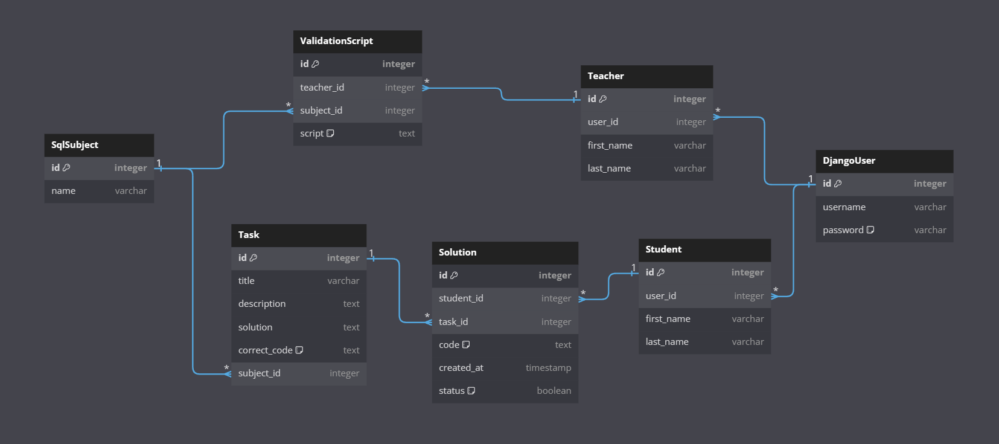

# Проект: e-Learning

Проект E-learning представляет собой платформу для обучения по программированию с возможностью взаимодействия между преподавателями и студентами.

# Предметы

Данный раздел представляет информацию о функционале предметов в образовательном проекте.

## Предмет "Python"

В настоящее время информация по предмету "Python" отсутствует. Мы работаем над обновлением и добавлением информации. Пожалуйста, ожидайте обновлений.

## Предмет "SQL"

Предмет "SQL" предоставляет возможность студентам изучать и практиковать SQL запросы.

### Функциональность

Предмет "SQL" включает в себя следующий функционал:

- **Задания для студентов**: Преподаватели могут создавать задания для студентов, задание включает в себя название, и эталонное решение.

- **Отправка решений**: Студенты отправляют свои решения заданий в виде SQL-запросов.

- **Проверка решений**: Для проверки решений используется скрипт, запускающийся с определенной переодичностью и проверяющий эталонное решение (добавленное преподавателем) с решениями студентов. Решению студента присваивается статус о правильности выполнения задания. 

- **История решений**: Студенты могут просматривать историю отправленных решений.

### Диаграмма базы данных

_Рисунок 1: Диаграмма базы данных предмета "SQL"._

## Приложения
- **core**
  для основных страниц сайта (для не авторизированных пользователей), 404
- **students**
  для авторизации студента и страниц контента для студентов
- **teachers**
  для авторизации преподавателя и страниц контента для преподавателей

## Установка проекта
1. Клонировать репозиторий
`git clone https://github.com/Eldar-Kadymov/webdev-course.git`

2. Перейти в директорию проекта
`cd webdev_course`

## Запуск проекта
Установить virtualenv (Если не установлено)
`pip install virtualenv`

1. Создать виртуальное окружение
`virtualenv venv`
2. Активировать виртуальное окружение
  - Windows
    `venv\Scripts\activate`
  - Linux/macOS
    `source venv/bin/activate`
3. Установить зависимости
`pip install -r requirements.txt`
4. Запуск проекта
`python manage.py runserver`
5. Завершение работы в виртуальном окружении
`deactivate`